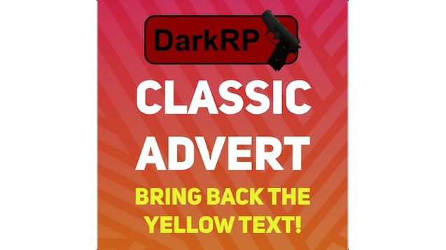
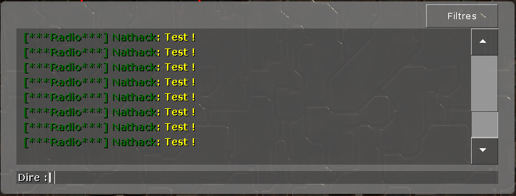

 

  

  <h3 align="center">Commande de Pub</h3>

  

Cette addon sert à crée des ppublicités de manière simple sur votre serveur !
    
 

## 📷 Images 

  

## ⚙️ How-To setup 
- Dans la racine /addons/darkrpmodification/darkp_modules
- Glissez-y le fichier
 
## 📚 Fonctions utiles 
